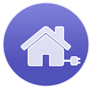
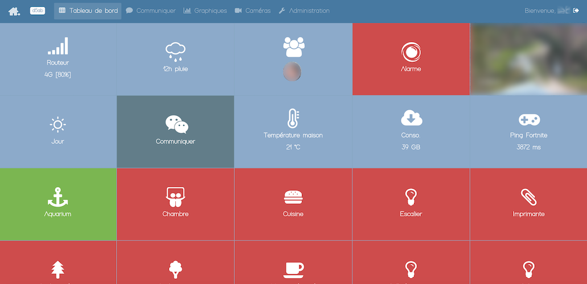
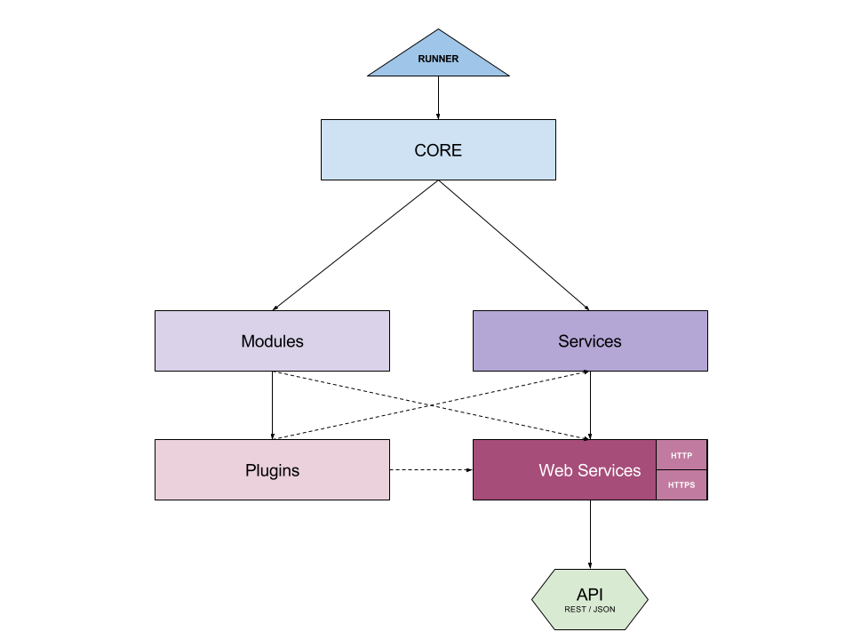

# Smarties-IO

Smarties is a **complete home automation system**. It allows you to **use multiple devices brands and orchestrate them together**, *for example you can turn on your Philips Hue lights with a Chacon switch*.

Smarties use Ngrok secured tunnel and can be accessed from everywhere without configuring your router, even over a 4G router !

**All data is stored on the local device** ! Yes, your privacy is very important. The system will only transmit smarties ID, boot date and tunnel url to a gateway. Those informations are needed to access system anywhere around the world.

The application can easily run on a **Raspberry PI** which implies a **really cheap home automation system**.

For developers, you can easily **create plugins**, lot of APIs are available and you can add a specific camera model or new light system.

The most important informations are presented with **tiles on dashboard**.

## Supported features

#### Radio communication devices (433.92 - Chacon, Zigbee - Philips, Xiaomi aqara, Ikea Tråfri, ...)

Using a RFLink will allow you to control lights and sensors for a really interesting price. Note that you'll need to buy a USB Gateway (http://www.rflink.nl) to access this feature.

Using a Conbee II USB key will allow you to control Zigbee lights, sensors and switches.

##### Philips Hue

Control Philips Hue lights, state and colors, for example in combination with 433 Mhz switches.

##### Tuya

Control Tuya outlets and lights

##### Cameras

Keep an eye on your house. You can check camera history over 5 days, and 2 timelapses are generated every day :
* Last 24 hours : Check in 60 sec whole past day (one picture per minute over 24h)
* Season : Contemplate the evolution of seasons (one picture per day over one year)

##### Communication / messaging

Receive notifications and never forget to put the trash out. Be alerted when a suspect activity occurred at home. This may need a USB Dongle with SIM card.
Interact with the system by sending messages (french only).

##### Sensors

Get daily / monthly / yearly statistics on your sensors : temperature, humidity, Internet throughput, ...

##### Alarm

Stay cool in holidays, Smarties will keep housebreakers out.

##### Scenarios

Create scenarios to automate home. For example, you can turn off all lights when nobody is at home, or prepare your coffee every morning at 7AM.
Send a message if the wind blows above 35 mph.

##### IOTs

Create your own cheap sensors or anything else using ESP8266 or Arduino. An Arduino framework is provided and is very easy to use.
Over The Air updates available.

##### HomeKit Siri and Alexa support

Use voice command to control home devices.

##### IFTTT

Basic IFTTT usage with scenario triggering URL (both way).

## Installation on Linux Debian / Raspbian

### Requirements

- Linux Raspberry PI 2 or 3 (armv7+ arch) or a x86_64 PC
- Debian or Raspbian stretch and above

		curl -sSL https://www.smarties.io/install-rep.sh | bash

## Environment

### Requirements

#### If you need to run / compile

* Node.js 10.14.1 or upper version
* Mac or Linux. *Windows is not yet supported.*
    - On Mac, brew mlust be installed
    - On Linux, only Debian system supported, tested on x86 and ARM architectures

#### If you need to run on Raspberry PI

A Raspberry PI with ethernet cable plugged, or WiFI already configured. For installation in this mode, refer to the "Deployment" section of this documentation.

### Installation

In console, type `npm install` and everything should go on.

### Start

`npm start`

Once app is started, open your browser and type https://me.smarties.io/.
Then, you have to login with default username `admin` and default password `admin`.

*Note : If you can't log in, check logs - If dependencies installation is finished, you may retrieve your `Smarties ID` which is a 4 hexadecimal code. This information is logged just after starting. Then open browser and type https://me.smarties.io/XXXX/ where `XXXX` is your smarties ID.*

### Rest API access

You can list the available rest APIS with https://me.smarties.io/XXXX/api/infos/ where `XXXX` is your smarties ID.

### Dev commands

* `npm update` : Update dependencies
* `npm run start` : Start Smarties
* `npm run dev` : Run dev server with lint
* `npm run test` : Run all unit test
* `npm run lint` : Check code issues
* `npm run coverage` : Generate test coverage
* `npm run test-ci` : Execute tests and generate test coverage
* `npm run doc` : Generate code documentation
* `npm run doc-apis` : Generate Public APIs documentation
* `npm run build` : Build for current architecture
* `npm run build-arm` : Build for current architecture with a arm binary node modules pick
* `npm run build-deb` : Build the deb from the build folder

## Global architecture

## Documentation

### Plugin tutorial

[Read](doc/PLUGIN.md)

#### Web Services API registration

[Read](src/services/webservices/README.md)

#### Configuration manager

[Read](src/modules/confmanager/README.md)

#### Threads manager

[Read](src/modules/threadsmanager/README.md)

#### Services

[Read](src/services/README.md)

#### Database manager

[Read](src/modules/dbmanager/README.md)

#### Translate manager

[Read](src/modules/translatemanager/README.md)

#### Form manager

[Read](src/modules/formmanager/README.md)

### Auto generated documentation

#### Public APIs

[Read](doc/PUBLIC-APIS.md)

#### Code documentation

[Read](doc/DOCUMENTATION.md)

### Troubleshooting

Nothing reported yet

# License

## MIT

Copyright © 2019, WoodySlum

Permission is hereby granted, free of charge, to any person obtaining a copy of this software and associated documentation files (the “Software”), to deal in the Software without restriction, including without limitation the rights to use, copy, modify, merge, publish, distribute, sublicense, and/or sell copies of the Software, and to permit persons to whom the Software is furnished to do so, subject to the following conditions:

The above copyright notice and this permission notice shall be included in all copies or substantial portions of the Software.

The Software is provided “as is”, without warranty of any kind, express or implied, including but not limited to the warranties of merchantability, fitness for a particular purpose and noninfringement. In no event shall the authors or copyright holders X be liable for any claim, damages or other liability, whether in an action of contract, tort or otherwise, arising from, out of or in connection with the software or the use or other dealings in the Software.

Except as contained in this notice, the name of the WoodySlum shall not be used in advertising or otherwise to promote the sale, use or other dealings in this Software without prior written authorization from the WoodySlum.

# Smarties-IO

Smarties is a **complete home automation system**. It allows you to **use multiple devices brands and orchestrate them together**, *for example you can turn on your Philips Hue lights with a Chacon switch*.

Smarties use Ngrok secured tunnel and can be accessed from everywhere without configuring your router, even over a 4G router !

**All data is stored on the local device** ! Yes, your privacy is very important. The system will only transmit smarties ID, boot date and tunnel url to a gateway. Those informations are needed to access system anywhere around the world.

The application can easily run on a **Raspberry PI** which implies a **really cheap home automation system**.

For developers, you can easily **create plugins**, lot of APIs are available and you can add a specific camera model or new light system.

The most important informations are presented with **tiles on dashboard**.

## Supported features

#### Radio communication devices (433.92 - Chacon, Zigbee - Philips, Xiaomi aqara, Ikea Tråfri, ...)

Using a RFLink will allow you to control lights and sensors for a really interesting price. Note that you'll need to buy a USB Gateway (http://www.rflink.nl) to access this feature.

Using a Conbee II USB key will allow you to control Zigbee lights, sensors and switches.

##### Philips Hue

Control Philips Hue lights, state and colors, for example in combination with 433 Mhz switches.

##### Tuya

Control Tuya outlets and lights

##### Cameras

Keep an eye on your house. You can check camera history over 5 days, and 2 timelapses are generated every day :
* Last 24 hours : Check in 60 sec whole past day (one picture per minute over 24h)
* Season : Contemplate the evolution of seasons (one picture per day over one year)

##### Communication / messaging

Receive notifications and never forget to put the trash out. Be alerted when a suspect activity occurred at home. This may need a USB Dongle with SIM card.
Interact with the system by sending messages (french only).

##### Sensors

Get daily / monthly / yearly statistics on your sensors : temperature, humidity, Internet throughput, ...

##### Alarm

Stay cool in holidays, Smarties will keep housebreakers out.

##### Scenarios

Create scenarios to automate home. For example, you can turn off all lights when nobody is at home, or prepare your coffee every morning at 7AM.
Send a message if the wind blows above 35 mph.

##### IOTs

Create your own cheap sensors or anything else using ESP8266 or Arduino. An Arduino framework is provided and is very easy to use.
Over The Air updates available.

##### HomeKit Siri and Alexa support

Use voice command to control home devices.

##### IFTTT

Basic IFTTT usage with scenario triggering URL (both way).

## Installation on Linux Debian / Raspbian

### Requirements

- Linux Raspberry PI 2 or 3 (armv7+ arch) or a x86_64 PC
- Debian / Raspbian stretch and above

    curl -sSL https://www.smarties.io/install-rep.sh | bash

## Environment

### Requirements

#### If you need to run / compile

* Node.js 10.14.1 or upper version
* Mac or Linux. *Windows is not yet supported.*
    - On Mac, brew mlust be installed
    - On Linux, only Debian system supported, tested on x86 and ARM architectures

#### If you need to run on Raspberry PI

A Raspberry PI with ethernet cable plugged, or WiFI already configured. For installation in this mode, refer to the "Deployment" section of this documentation.

### Installation

In console, type `npm install` and everything should go on.

### Start

`npm start`

Once app is started, open your browser and type https://me.smarties.io/.
Then, you have to login with default username `admin` and default password `admin`.

*Note : If you can't log in, check logs - If dependencies installation is finished, you may retrieve your `Smarties ID` which is a 4 hexadecimal code. This information is logged just after starting. Then open browser and type https://me.smarties.io/XXXX/ where `XXXX` is your smarties ID.*

### Rest API access

You can list the available rest APIS with https://me.smarties.io/XXXX/api/infos/ where `XXXX` is your smarties ID.

### Dev commands

* `npm update` : Update dependencies
* `npm run start` : Start Smarties
* `npm run dev` : Run dev server with lint
* `npm run test` : Run all unit test
* `npm run lint` : Check code issues
* `npm run coverage` : Generate test coverage
* `npm run test-ci` : Execute tests and generate test coverage
* `npm run doc` : Generate code documentation
* `npm run doc-apis` : Generate Public APIs documentation
* `npm run build` : Build for current architecture
* `npm run build-arm` : Build for current architecture with a arm binary node modules pick
* `npm run build-deb` : Build the deb from the build folder

## Global architecture

## Documentation

### Plugin tutorial

[Read](doc/PLUGIN.md)

#### Web Services API registration

[Read](src/services/webservices/README.md)

#### Configuration manager

[Read](src/modules/confmanager/README.md)

#### Threads manager

[Read](src/modules/threadsmanager/README.md)

#### Services

[Read](src/services/README.md)

#### Database manager

[Read](src/modules/dbmanager/README.md)

#### Translate manager

[Read](src/modules/translatemanager/README.md)

#### Form manager

[Read](src/modules/formmanager/README.md)

### Auto generated documentation

#### Public APIs

[Read](doc/PUBLIC-APIS.md)

#### Code documentation

[Read](doc/DOCUMENTATION.md)

### Troubleshooting

Nothing reported yet

# License

## MIT

Copyright © 2019, WoodySlum

Permission is hereby granted, free of charge, to any person obtaining a copy of this software and associated documentation files (the “Software”), to deal in the Software without restriction, including without limitation the rights to use, copy, modify, merge, publish, distribute, sublicense, and/or sell copies of the Software, and to permit persons to whom the Software is furnished to do so, subject to the following conditions:

The above copyright notice and this permission notice shall be included in all copies or substantial portions of the Software.

The Software is provided “as is”, without warranty of any kind, express or implied, including but not limited to the warranties of merchantability, fitness for a particular purpose and noninfringement. In no event shall the authors or copyright holders X be liable for any claim, damages or other liability, whether in an action of contract, tort or otherwise, arising from, out of or in connection with the software or the use or other dealings in the Software.

Except as contained in this notice, the name of the WoodySlum shall not be used in advertising or otherwise to promote the sale, use or other dealings in this Software without prior written authorization from the WoodySlum.
